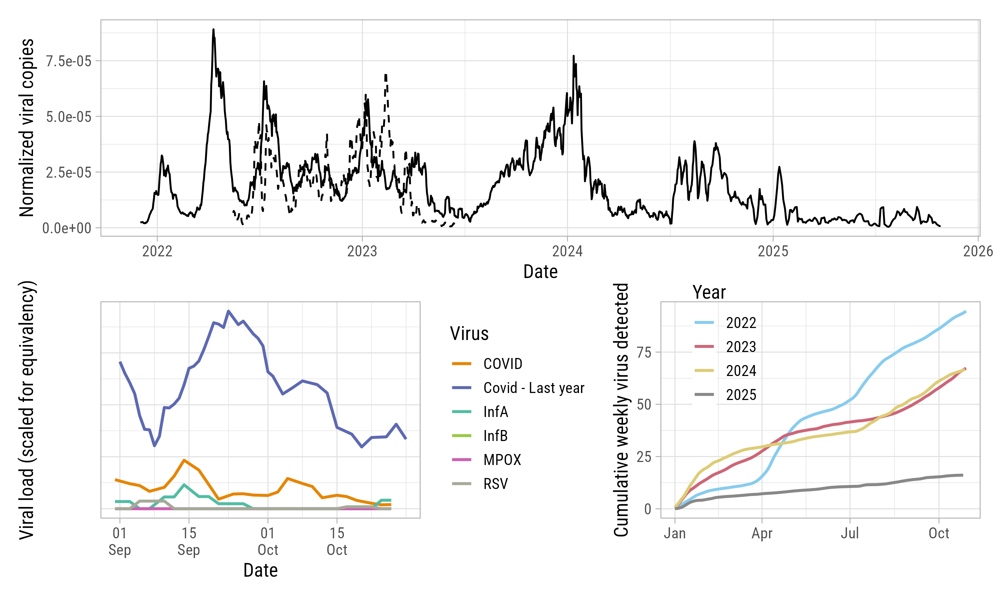

# The Public Health Environmental Surveillance Database (PHESD)

## Description

The repository is used to store Ottawa Wastewater Surveillance data from the [Delatolla Lab](https://delatolla-research-group.ca) using the Public Health Environmental Surveillance Open Data Model ([PHES-ODM](https://github.com/Big-Life-Lab/PHES-ODM)).

## Recommended Citation (APA)

Mercier, É., D'Aoust, P., Pisharody, L. K., Hegazy, N., Wan, S., Tian, X., Tomalty, E., Kabir, M. P., Nguyen, T. B., Wong, C. H., Ramsay, N. T., Addo, F., & Delatolla, R. (2024). The Public Health Environmental Surveillance Database (PHESD) - Delatolla Lab v2.0.0 (Wastewater_Surveillance). Zenodo. https://doi.org/10.5281/zenodo.10794558

## Background

Wastewater testing and surveillance (WWS) has a long history as a public health tool, helping us monitor polio outbreaks and track antimicrobial resistance. With the COVID-19 pandemic and the emergence of the SARS-CoV-2 virus, a new opportunity has emerged to leverage WWS to inform prevention and control of the pandemic. People infected with the SARS-CoV-2 virus shed the virus in their stool, meaning that the feces in wastewater systems can be checked to detect outbreaks and monitor for variants even before people become symptomatic. With over 200 wastewater testing sites across Canada, and over 2000 testing sites in over 50 countries, WWS has proven itself to be an effective tool in the fight against the virus. However, despite the rapid growth in this field and the swift deployment of WWS programs nationally, there is very little data sharing due to the absence of a centralized data repository with controlled vocabulary. This absence has led to varied data and assay quality, inconsistent reporting of wastewater test results, little adjustment of wastewater results, and has slowed the development of wastewater-based epidemiology.

Intended as a centralized database, PHESD currently only stores Wastewater Surveillance data from Ottawa that is generated by the [Delatolla Lab](https://delatolla-research-group.ca). The guiding idea being that making this data openly aailable will shrink the delay between the measurement and analysis, and provide more data for better modeling, better collaboration, and better tools in the fight against the COVID-19 pandemic.  

To ensure that the PHESD is usable for all users, we use the Public Health Environmental Surveillance Open Data Model ([PHES-ODM](https://github.com/Big-Life-Lab/PHES-ODM)). The PHES-ODM an open, standard approach to share wastewater surveillance data. The PHES-ODM helps the wastewater surveillance community collaborate by allowing teams worldwide to share their data in a common structure. The model uses a relational dictionary to map more than 150 variables into 10 tables, and offers documentation on how to use the model, template files to record data in the PHES-ODM format, and scripts of code to set up a relational database according to the PHES-ODM schema.

## Current Objectives

-   **Easily share wastewater data.** The PHESD is focused on and built for Canadian data, but we are happy to revieve data from anywhere. The goal is to create one space to easily share data between researchers and programs.

-   **Allow detailed wastewater data.** This is a distinction between PHESD and other repositories - with the PHESD we allow for the storage of even detailed data. This means storing details on variants and sequencing, among other details.

-   **Easy to add data.** This database will use the Public Health Environmental Surveillance Open Data Model ([PHES-ODM](https://github.com/Big-Life-Lab/PHES-ODM)) to allow wastewater testing labs to share their using an open access, open science approach in a shared format. To help support labs and other data custodians is adopting the PHES-ODM format for the PHESD, we have developed a suite of tools to automate data validation using the Open Data Model validation schema and rule set. We can automatically add your data if it is in the PHES-ODM format on common data platforms like Dropbox, Sync, Google Drive, ArcGIS. This automatic data scraping can come from open access sources, but to preserve privacy for some labs we may scrap to a private version of this GitHub repository, which we then scrap onto this public-facing repository.

## Important Note:

A method modification was applied on June 8th 2021 to the Ottawa wastewater data set. The magnitudes (not the shape of the curve) from June 8th to present have been retroactively modified on April 12, 2022 to better align the modified method to previous data.
